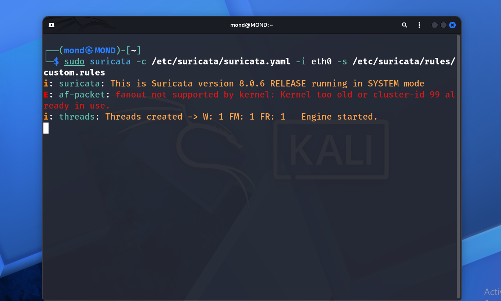
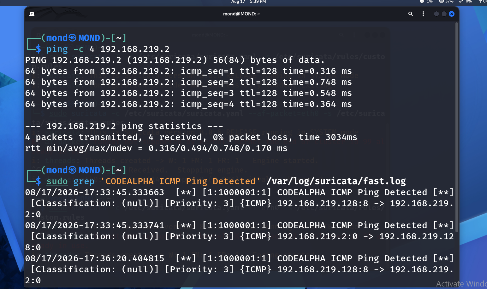

# CodeAlpha Network Intrusion Detection System

## Overview

This project implements a Network Intrusion Detection System (NIDS) using Suricata.

The system monitors network traffic and detects suspicious activity using predefined and custom detection rules.

## Objectives

- Monitor network traffic.
- Detect suspicious network activity.
- Configure Suricata as a network-based IDS.
- Create and test a custom detection rule.
- Analyze generated security alerts.

## Technologies Used

- Kali Linux
- Suricata 8.0.6
- Linux Networking
- ICMP
- YAML Configuration
- Suricata Rules

## Network Configuration

- Network Interface: `eth0`
- Local IP: `192.168.219.128`
- Network: `192.168.219.0/24`
- Gateway: `192.168.219.2`

The monitored network was configured as the Suricata `HOME_NET`.

## Suricata Configuration

Suricata was configured to monitor the `eth0` network interface.

The `HOME_NET` variable was configured as:

```text
192.168.219.0/24
```

Official Suricata rules were downloaded using `suricata-update`.

## Custom Detection Rule

A custom ICMP detection rule was created to demonstrate real-time threat detection:

```text
alert icmp any any -> $HOME_NET any (msg:"CODEALPHA ICMP Ping Detected"; sid:1000001; rev:1;)
```

The rule generates an alert when ICMP traffic is detected toward the configured home network.

## Testing

The IDS was tested using an ICMP ping against the local network gateway:

```bash
ping -c 4 192.168.219.2
```

Suricata successfully detected the ICMP traffic and generated a security alert.

Example alert:

```text
[1:1000001:1] CODEALPHA ICMP Ping Detected
{ICMP} 192.168.219.128:8 -> 192.168.219.2:0
```

The detection was recorded in Suricata's alert log.

## Results

The project successfully demonstrated:

1. Suricata installation and configuration.
2. Network traffic monitoring.
3. Custom detection rule creation.
4. Real-time ICMP traffic detection.
5. Security alert generation.
6. Security event logging.

## Project Structure

```text
CodeAlpha_NetworkIntrusionDetectionSystem/
│
├── README.md
│
├── rules/
│   └── custom.rules
│
├── screenshots/
│   ├── suricata-running.png
│   └── detection-alert.png
│
└── config/
    └── suricata.yaml
```

## Screenshots

### Suricata Running

The screenshot demonstrates Suricata running successfully on the monitored network interface.



### ICMP Detection Alert

The screenshot demonstrates the custom ICMP detection rule successfully identifying network traffic and generating an alert.



## Security Concepts Demonstrated

This project demonstrates practical knowledge of:

- Network Intrusion Detection
- Network Traffic Monitoring
- Security Event Detection
- Signature-Based Detection
- Custom IDS Rules
- ICMP Traffic Analysis
- Security Logging
- Linux Network Interfaces

## Future Improvements

Possible future improvements include:

- Adding port scanning detection rules.
- Detecting suspicious DNS activity.
- Detecting HTTP-based attacks.
- Creating additional custom Suricata rules.
- Visualizing security alerts.
- Integrating Suricata with a SIEM platform.
- Building a security monitoring dashboard.

## Internship

This project was developed as part of the **CodeAlpha Cyber Security Internship**.

**Task:** Network Intrusion Detection System

**Tool:** Suricata

**Platform:** Kali Linux
